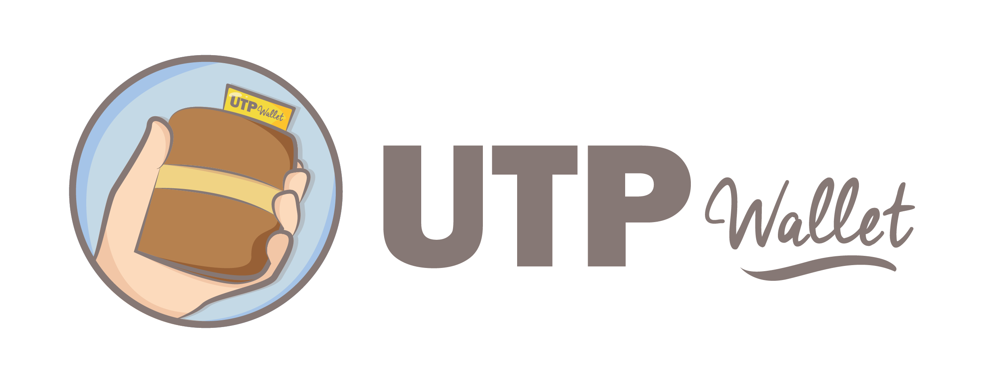
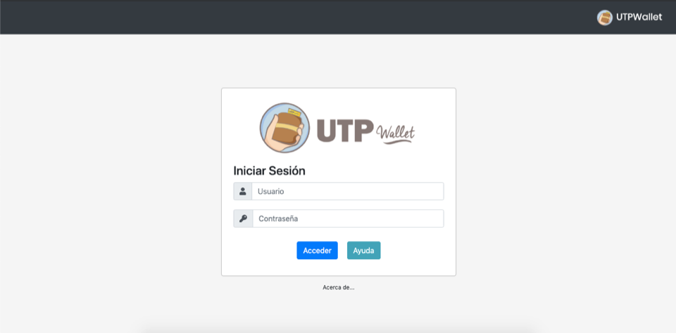
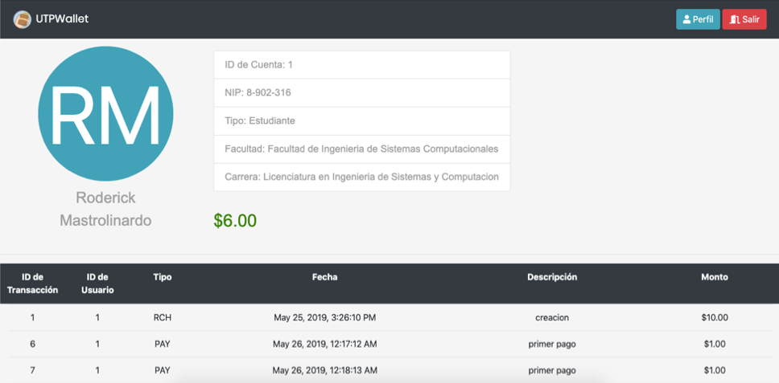
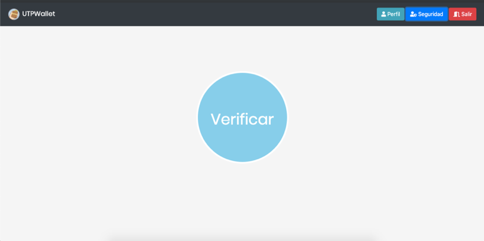
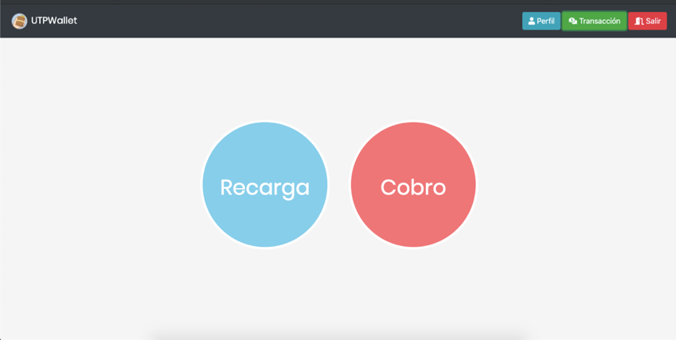
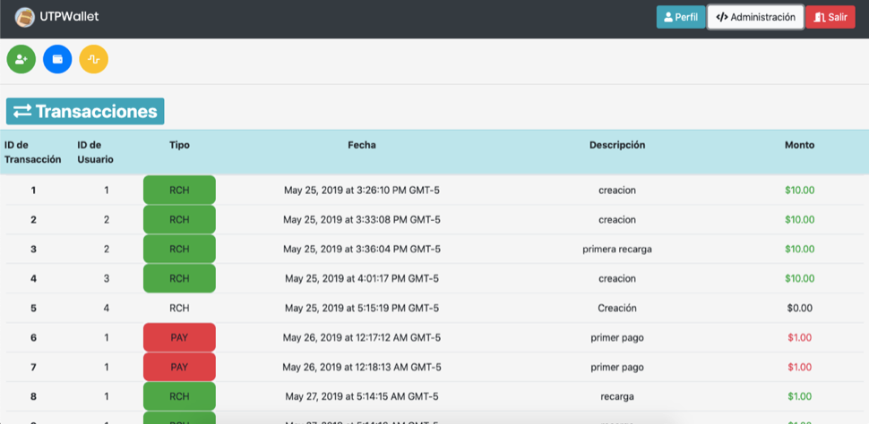

# UtpWallet

A web based application dedicated for the Technological University of Panama internals credencials and transacctions.

## Setup
Since the application was build using [Angular 7.3.8](https://github.com/angular/angular-cli), you will need to have that installed, is you have that checked out just go the project directory and run the following code to get all the dependency stated in the package.json file:

```javascript
npm install
```

You will also need [Python 3](https://www.python.org/) and the [Flask](https://palletsprojects.com/p/flask/) and [Flask-cors](https://flask-cors.readthedocs.io/en/latest/) Library to be able to test all the Features related to the NFC Tags.

Besides these dependency you will also need an [Arduino One](https://store.arduino.cc/usa/arduino-uno-rev3) Board to load the **read_write.ino** located in the utpwallet_arduino folder.

## Screenshots






## Usage
In order to run the application you need to first get all the points mentioned in the **Setup** section.

### Arduino
To run the local API to access the NFC fetures, go to the **utpwallet_arduino** directory and run the app.py using python 3.

```python
python3 app.py
```

### Angular
To run the angular dev server using node.js, you will need to go the root directory of the project, and run:

```javascript
ng serve
```

Go to your prefered browser (I personally prefer Chrome), then navigate to `http://localhost:4200/`. The app will automatically reload if you change any of the source files.

## Authors
* **Luis Yao** - Front-end Developer - [LinkedIn](https://www.linkedin.com/in/luisyaoyang/)
* **Roderick Mastrolinardo** - Back-end Develper - [Twitter](https://twitter.com/RodMastro)

## Acknoledgement
* **Omar Mejía** - Fullstack Developer - [LinkedIn](https://www.linkedin.com/in/omar-mejia-35940a161/)